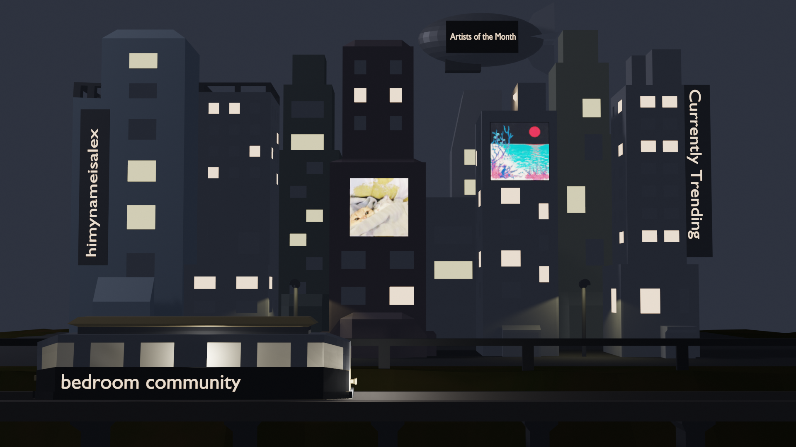
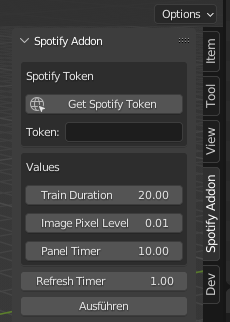
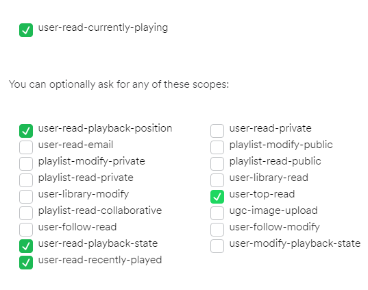

# Datenverarbeitung in der Medienproduktion
Gruppenmitglieder: Samuel Kasper, Daniel Meisler, David Niemann, Alexander Reiprich  
Thema: Spotify API Visualizer
___
## Kurzbeschreibung
In diesem Repository findet man die Endabgabe unseres Projekts für das Modul "Datenverarbeitung in der Medienproduktion" an der HFU im Sommersemester 2022.

Im Rahmen dieses Projektes haben wir uns mit der Spotify API beschäftigt, und diese genutzt um ein Addon in Blender zu erstellen, welches das Hörverhalten des Spotifynutzers abbildet.

Dargestellt wird eine Großstadt mit Hochhäusern, an welchen Leuchtbildtafeln angebracht sind. Auf diesen werden Statistiken sowie das Coverbild des aktuell abgespielten Songs angezeigt. Zusätzlich zeigt die Tageszeit den Fortschritt im Lied, und ein durchfahrender Zug den Namen des momentanen Songs an.

 

## How to install

1. Blender herunterladen und installieren.
2. Dieses Repository herunterladen und entpacken.
3. cv2 installieren (Der Prozess kann unter Umständen nach Blenderversion variieren - cv2 sollte schlussendlich unter  "C:\Program Files\Blender Foundation\Blender 3.1\3.1\python\lib\site-packages"  installiert sein. Sollte das nicht funktionieren, muss die Installation manuell erfolgen.)
4. Blender aus dem entpackten Respositoryordner starten.
5. In Blender auf Preferences -> Add-ons -> Install klicken und die heruntergeladene \_\_init__.py auswählen.
6. Wenn nicht schon geschehen, das Addon aktivieren.
___
## How to use

1. Blender starten und das Addon mit F3 unter "Spotify API Visualizer" suchen und ausführen.
2. Das zugehörige Panel oben rechts mit dem Pfeil ausklappen und auf "Get Spotify Token" klicken.

3. Auf der sich geöffneten Seite auf "Get Token" klicken, und folgende Scopes auswählen:

4. Anmeldevorgang fortführen.
5. Token aus der Zeile neben dem "Get Token" Knopf kopieren und in Blender in das vorgesehene Feld eingeben.
6. Wenn gewünscht, Parameter ändern.
7. Falls noch nicht geschehen, in Spotify ein Lied abspielen lassen.
8. Auf "Ausführen" drücken.
9. Nun wird die Szene generiert und basierend auf die aktuelle Spotify-Aktivität dynamisch angepasst.
